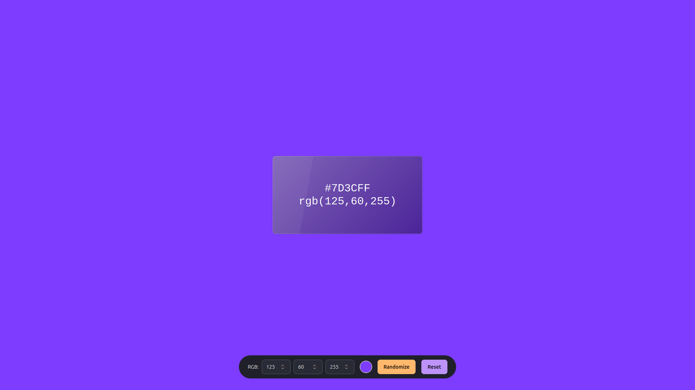

# 🎨 Color Converter

A simple React + TypeScript app that lets you input an RGB color and view its HEX representation.  
The page background updates to the selected color so you can preview it instantly.  

## 🚀 Features
- Convert **RGB → HEX**
- Live color preview as background
- Minimal & clean interface

## 🖼️ Preview

## 🛠️ Tech Stack
- [React](https://reactjs.org/)
- [TypeScript](https://www.typescriptlang.org/)
- [Vite](https://vitejs.dev/)